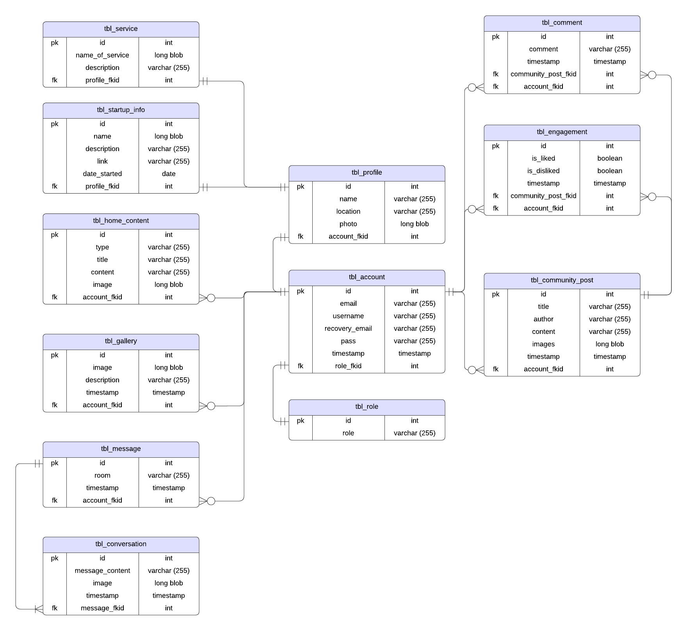

# Project Name: ICONS

## Introduction
The Icons Server-side Configuration project, employing a hybrid approach blending Clean Architecture and MVC Architecture, stands as the backbone for a collaborative platform connecting startups and incubating partners. This repository hosts the backend source code, utilizing Express and MySQL to orchestrate the platform's core functions. The aim is to offer startups and their supporters a unified space for seamless information exchange and resource sharing. The backend adeptly handles API interactions and database operations, fostering smooth communication between startups and incubators.

## Technologies Used
- **Framework**: Express.js
- **Database**: MySQL
- **Architecture**: Clean Architecture & MVC
- **Authentication**: JSON Web Tokens (JWT)
- **Testing**: <i>to be announced ...</i>
- **Documentation**: Documentation
- **Deployment**: <i>to be announced ...</i>
- **Version Control**: Git

## Installation
1. Clone the repository using the command below:   `[git clone https://github.com/yourusername/icons-backend.git](https://github.com/arvinmalaluan/icons-server-side-config.git)`
2. Install dependencies:   `npm install`
3. Set up the database schema using the provided ERD: [ERD](img/erd.png)

## Database Schema

The database schema is designed according to the Entity-Relationship Diagram (ERD). It consists of tables for startups, partners, users, and collaboration relationships.

### How to run on a local server?
1. Open XAMPP, then click `start` for `Apache` and `MySQL`.
2. Open browser and navigate to this site `http://localhost/phpmyadmin/`.
3. Click `SQL` located at the `Navigation Bar`.
4. Paste the script found in [Database Schema](files/db.setup.sql) and click **`Go`**

## API Documentation
Explore the API endpoints provided by the Icons Backend:
- Endpoint URLs: [API Documentation](link-to-postman-docs)
- HTTP methods: GET, POST, PUT, DELETE
- Request/response formats: JSON
- Authentication: JWT
